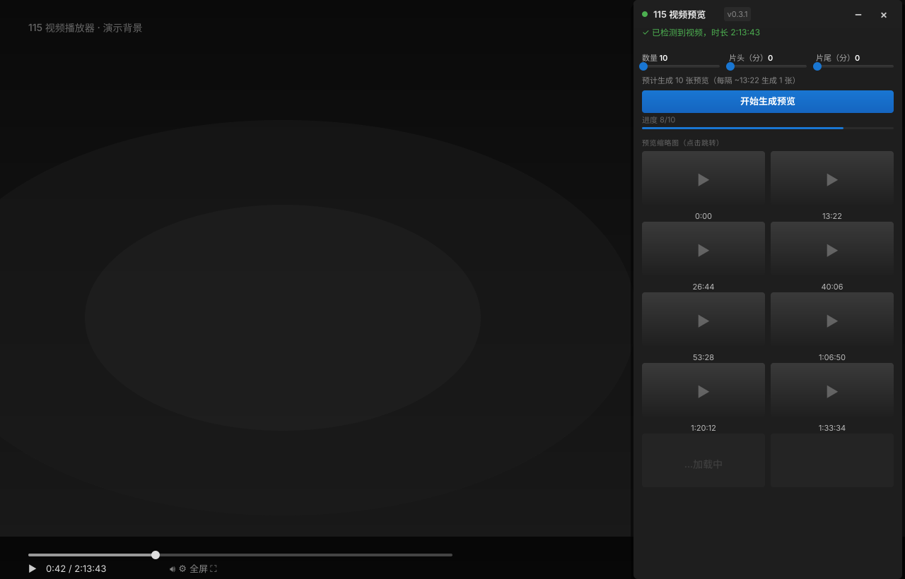

# 115 Thumbnailer（115 视频预览缩略图）

> 为 115 网盘视频生成均匀分布的预览缩略图 — 点击任意缩略图即可跳转到对应时间点继续播放。

一款 Chrome / 115 浏览器 MV3 扩展，会在 115 视频页内嵌入一个浮窗。设置数量后点 **开始生成预览**，面板会按时间均匀抓取缩略图，让你用 20 张图就能扫完一部 2 小时长视频。

同时支持新版播放器（`115.com/players/video/...`）和老版播放器（`115vod.com/?pickcode=...`）。

[](#)
[](#)
[](#)
[](#)



---

## ✨ 功能特性

- **一键预览** — 设置数量后，面板自动按时间均匀抓取 320×180 缩略图。
- **点击跳转** — 每张缩略图都是一个时间点，点击后视频立即跳到该处并继续播放。
- **数量可调** — 滑块 `10`–`100`，默认 `10`。「预计间隔」提示行实时刷新。
- **跳过片头/片尾** — 滑块单位为分钟，最大值自动跟随视频时长（`⌈时长/60⌉`），方便跳过 OP/ED。
- **面板可调大小** — 拖右下角或左下角手柄；缩略图大小不变，网格能看到更多。
- **移动/折叠/关闭** — 拖标题栏移动，`−` 折叠，`×` 关闭（点工具栏图标重开）。
- **状态持久化** — 数量、滑块、位置、尺寸、可见性全部存在 `chrome.storage.local`。
- **后台标签页安全** — 标签页不可见时自动暂停，回前台后继续抓取。
- **CSP 兼容** — 零 `fetch`、零 `eval`。content script 是一份自包含文件，CSS 以字符串内联 — 这是绕过 115 严格内容安全策略的唯一方案。

## 📦 安装（加载已解压的扩展程序）

1. 克隆或下载本仓库。
2. 打开 `chrome://extensions/`（115 浏览器请用 `115://extensions/`）。
3. 开启右上角 **开发者模式**。
4. 点 **加载已解压的扩展程序**，选择仓库根目录。
5. 工具栏会出现 `115 Thumbnailer` 图标。

需要分发包请看下面的 [构建与发布](#-构建与发布)。

## 🚀 使用方法

1. 打开 `115.com` / `115vod.com` / `115pan.com` / `anxia.com` 上的任意视频。
2. 浮窗自动出现在右上角；之前关过的话，点工具栏图标重开。
3. 调整 **数量 / 跳过片头 / 跳过片尾** 滑块（默认 `10 / 0 / 0`）。
4. 提示行会实时显示，如「预计生成 50 张预览（每隔 ~1:10 生成 1 张）」。
5. 点 **开始生成预览** — 缩略图随抓取逐张出现。
6. 拖标题栏移动面板；用 `−` / `×` 折叠或关闭。
7. 点击任意缩略图 → 视频跳到该时间点并继续播放。

> 💡 抓取期间请停留在当前标签页。脚本会在 `visibilitychange` 时自动暂停、回前台后继续，但中途切走会拖慢进度。

## ⚙️ 配置项

所有设置都在面板内，按浏览器分别持久化：

| 设置 | 范围 | 默认值 | 作用 |
| --- | --- | --- | --- |
| 数量 | `10`–`100` | `10` | 想要抓取的缩略图数量。实际数量为该值与有效时间窗口允许值中的较小者。 |
| 跳过片头 | `0`–`⌈时长/60⌉` 分钟 | `0` | 跳过开头的分钟数。 |
| 跳过片尾 | `0`–`⌈时长/60⌉` 分钟 | `0` | 跳过结尾的分钟数。 |

抓取间隔 = `有效时长 / 数量`，提示行实时展示。

## 🛠 开发

```bash
# 首次安装依赖
npm install

# 跑单测（应 27/27 通过）
npm test          # node --test lib/utils.test.js

# 打 zip（如果存在 key.pem 则同时打 crx）
npm run build
```

构建产物输出到 `dist/`：

- `115-video-preview.zip` — 可作为「打包后的扩展」加载到 `chrome://extensions/`。
- `115-video-preview.crx` — 仅当先跑过 `npm run gen-key` 时才会生成。

### 源码结构

```
manifest.json                  # MV3 清单：名称 / 描述 / 图标
background.js                  # service worker：工具栏点击 → 切换浮窗
content/
  content.js                   # 整个扩展的逻辑都在这：面板 + 抓取 + 跳转
                               # （CSS 以字符串内联，Shadow DOM 隔离）
lib/
  utils.js                     # 纯函数：formatTime / computePlanByCount / validateInputs
  utils.test.js                # 27 个单测（node --test）
icons/
  icon-{16,48,128}.png         # 工具栏 / 应用商店图标
build.js                       # terser → zip → 可选 crx
gen-key.js                     # 生成 key.pem（用于签名 crx）
```

### 抓取原理

1. 在页面里挑出主 `<video>` 元素（带重试 — 115 播放器对 DOM 动手很勤）。
2. 暂停视频，按计划时间戳依次 `currentTime = t` + 等 `seeked`（15s 超时，`requestVideoFrameCallback` + `requestAnimationFrame` 竞争）。
3. `canvas.drawImage(video, ...)` → `canvas.toDataURL('image/jpeg', 0.7)` → 注入为 `` 进入网格。
4. 每张图最多重试 3 次；`document.visibilityState === 'hidden'` 时自动暂停。

### 不去硬刚的约束

- 115 的 CSP 会拦截 `fetch('chrome-extension://…')`、`eval`、内联 `<script>`。content script 必须是一份自包含 JS，CSS 字符串内联。
- `content_scripts` **不**加 `all_frames: true` — 多 iframe 页面会重复实例化浮窗，破坏 toggle 逻辑。
- 老版 115 播放器注入 `<video>` 较晚，脚本会在导航后轮询 DOM 几秒。

## ⚠️ 限制

- 仅在 115 网盘域名生效（`*.115.com` / `*.115vod.com` / `*.115pan.com` / `*.anxia.com`）。
- 缩略图**不**做跨会话缓存 — 关闭面板即清空。
- 抓取期间需要当前标签页为活动标签页（不可见会自动暂停，但卸载后不会继续跑）。
- 自定义 canvas 渲染器（非真实 `<video>`）的视频，seek 与截图会失败，暂不做兜底。

## 📝 许可

MIT — 见源码头。可任意使用、修改、再分发。

---

🌐 **语言：** [English](README.md) · [简体中文](README.zh-CN.md)